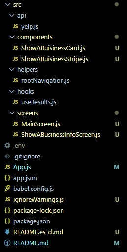

[](https://github.com/rafaelsoteldosilva/restaurants-suggestions/blob/main/README.md)

# **Restaurant suggestions in Santiago**

Fecha de creación: octuber 2021

Autor: Rafael Soteldo

Principales tecnologías usadas:

-  React,
-  React Native,
-  React Native Navigation,
-  Expo,
-  Consuming Yelp Api,
-  hooks

Yelp es una compañía norte amercicana que publica `reviews` de fuentes como `Restaurants`, `Bars`, `Coffee & Tea`, `Nightlife`, etc. por todo el mundo

---

<p align="center">
  
</p>

---

## **Guía de instalación**

-  Haga `GIT Clone` de este repo en su disco duro
-  `cd` dentro del directorio creado
-  Ejecute `npm install` para instalar todas las dependencias
-  Obtenga un token de autorización de Yelp:

   -  Vaya a `Yelp Fusion`
   -  Haga click en `Explore Yelp Fusion`
   -  `Sign Up` o `Login`
   -  haga click en `Manage App`
   -  Copie la `API Key`
   <p align="center">
      
      
      
      
   </p>

-  Cree un archivo `.env` en el directorio raiz
-  Pegue la CLAVE en este archivo, dándole el nombre de `YELP_AUTH`

```jsx
// .env
YELP_AUTH=kEkwpzpequ7OqfqPEJ9zIH6nSEpUiNQW8...
```

Ahora, para poder ejecutar la app en su dispositivo, debe instalar `Expo` en él:

<p align="center">
   
</p>

Una vez que `Expo` fue instalado en su dispositivo, debe ejecutar la app desde `VS COde` o su `IDE` favorito

<p align="center">
   
</p>

Usted puede escanear el código QR que está allí, or, como yo, vaya a `http://localhost:19002`:

<p align="center">
   
</p>

Una vez allí, `Expo` le da la posibilidad de ejecutar la app en un emulador, si desea continuar con el dispositivo físico, puede ahora escanear el QR con `Expo` en su dispositivo

<p align="center">
   
</p>

Así es com o luce mi tema obscuro, entonces presione `Scan QR cede`, y, listo...

Debe estar usando la misma wifi (desde la computadora y su dispositivo) para que funcione, si quiere usar sus datos de la compañía telefónica, puede usar la opción `tunnel` que se encuentra en `localhost:19002` (toma un poco más de tiempo en construirse pero funciona. Pero debe tener cuidado, si cambia el tipo de conexión, `Expo` se queda configurado como tal, y si lo pone como antes, no funcionará. Debe haber una forma de reconfigurar `Expo`, pero mientras tanto, desinstalar y volver a instalar `Expo` es una solución)

## **Sobre el proyecto**

Esta app fue desarrollada para que sea usada en cualquier dispositivo móvil.

Dada una preferencia de tipo de comida, muestra sugerencias reales en la ciudad de santiago de Chile (mediante el uso de la Api Fussion de Yelp https://fusion.yelp.com/).

Estas sugerencias son mostradas en tres categprías: baratas (cost-effective), un poco más caras (Bit Pricier) y más caras (Big Spender) (Tres cintas escroleables)

<p align="center">
   
</p>

Cada categría mostrará el número de locales reales encontrados, el rating de cada local, el número de `reviews` dados por los usuarios de cada local, y una imagen.

## **Estructura del proyecto**

La estructura del proyecto es la siguiente

<p align="center">
  
</p>

El directorio que contiene la mayor parte de la lógica es **src**, con el siguiente contenido:

-  **src/api/yelp.js**, contiene el `create de axios` por defecto,
-  **src/components**, contiene los componentes usados por las pantallas reales,
-  **src/helpers/rootNavigation.js**, expone las funciones de navegación, insertadas a un `ref`por el proveedor NavigationContainer,
-  **src/hooks/useResults.js**
-  **src/screens**, contiene las pantallas de la app, similar a las páginas de un proyecto puro `React`,

Este documentos explica las partes constituyentes del proyecto, en el mismo orden en el que aparecen en `VS Code` (ver imagen de arriba)

Las principales tecnologías usadas por este proyecto son:

-  React Native,
-  React Native Elements,
-  Hooks,
-  React Native Navigation,
-  Expo

### **El directorio src**

El directorio **src** es el principal directorio del proyecto, ya que contiene casi todos los archivos funcionales que hacen a la app entera.

Sus principales sub-directorios son:

-  **api**
-  **components**
-  **helpers**
-  **hooks**
-  **screens**

### - **<ins>src/api/yelp.js</ins>**

Está a cargo de crear una instancia de axios, como también la configuración de los headers de cada request

```jsx
export default axios.create({
   baseURL: "https://api.yelp.com/v3/businesses",
   headers: {
      Authorization: `Bearer ${YELP_AUTH}`,
   },
});
```

Note que uso el endpoint `businesses` de la api yelp.

Podríamos hacer consultas desde `Postman`, por ejemplo, si quisieramos obtener 8 restaurantes, en el área de New York City (NYC), podríamos hacer lo siguiente:

1- Comenzar a construir el query, y pegar el YELP_AUTH que usted obtuvo de la website yelp-fussion.

<p align="center">
  
</p>

2- ahora añadir los parámetros:

<p align="center">
  
</p>

3- Ahora hacer click en SEND, el resultado sería:

```
{
    "businesses": [
        {
            "id": "H4jJ7XB3CetIr1pg56CczQ",
            "alias": "levain-bakery-new-york",
            "name": "Levain Bakery",
            "image_url": "https://s3-media3.fl.yelpcdn.com/bphoto/DH29qeTmPotJbCSzkjYJwg/o.jpg",
            "is_closed": false,
            "url": "https://www.yelp.com/biz/levain-bakery-new-york?adjust_creative=HQql3bXf5X8gxeg-FkuQ4A&utm_campaign=yelp_api_v3&utm_medium=api_v3_business_search&utm_source=HQql3bXf5X8gxeg-FkuQ4A",
            "review_count": 8931,
            "categories": [
                {
                    "alias": "bakeries",
                    "title": "Bakeries"
                }
            ],
            "rating": 4.5,
            "coordinates": {
                "latitude": 40.779961,
                "longitude": -73.980299
            },
            "transactions": [],
            "price": "$$",
            "location": {
                "address1": "167 W 74th St",
                "address2": "",
                "address3": "",
                "city": "New York",
                "zip_code": "10023",
                "country": "US",
                "state": "NY",
                "display_address": [
                    "167 W 74th St",
                    "New York, NY 10023"
                ]
            },
            "phone": "+19174643769",
            "display_phone": "(917) 464-3769",
            "distance": 8369.262424680568
        },
        {
            "id": "V7lXZKBDzScDeGB8JmnzSA",
            "alias": "katzs-delicatessen-new-york",
            "name": "Katz's Delicatessen",
            "image_url": "https://s3-media1.fl.yelpcdn.com/bphoto/mrIdx2pZ3pR2UlqjKsSMZA/o.jpg",
            "is_closed": false,
            "url": "https://www.yelp.com/biz/katzs-delicatessen-new-york?adjust_creative=HQql3bXf5X8gxeg-FkuQ4A&utm_campaign=yelp_api_v3&utm_medium=api_v3_business_search&utm_source=HQql3bXf5X8gxeg-FkuQ4A",
            "review_count": 13673,
            "categories": [
                {
                    "alias": "delis",
                    "title": "Delis"
                },
                {
                    "alias": "sandwiches",
                    "title": "Sandwiches"
                },
                {
                    "alias": "soup",
                    "title": "Soup"
                }
            ],
            "rating": 4.0,
            "coordinates": {
                "latitude": 40.722237,
                "longitude": -73.9875259
            },
            "transactions": [
                "pickup",
                "delivery"
            ],
            "price": "$$",
            "location": {
                "address1": "205 E Houston St",
                "address2": "",
                "address3": "",
                "city": "New York",
                "zip_code": "10002",
                "country": "US",
                "state": "NY",
                "display_address": [
                    "205 E Houston St",
                    "New York, NY 10002"
                ]
            },
            "phone": "+12122542246",
            "display_phone": "(212) 254-2246",
            "distance": 1952.3706239726876
        },
        {
            "id": "44SY464xDHbvOcjDzRbKkQ",
            "alias": "ippudo-ny-new-york-7",
            "name": "Ippudo NY",
            "image_url": "https://s3-media1.fl.yelpcdn.com/bphoto/zF3EgqHCk7zBUwD2B3WTEA/o.jpg",
            "is_closed": false,
            "url": "https://www.yelp.com/biz/ippudo-ny-new-york-7?adjust_creative=HQql3bXf5X8gxeg-FkuQ4A&utm_campaign=yelp_api_v3&utm_medium=api_v3_business_search&utm_source=HQql3bXf5X8gxeg-FkuQ4A",
            "review_count": 10278,
            "categories": [
                {
                    "alias": "ramen",
                    "title": "Ramen"
                }
            ],
            "rating": 4.0,
            "coordinates": {
                "latitude": 40.73092,
                "longitude": -73.99015
            },
            "transactions": [
                "pickup",
                "delivery"
            ],
            "price": "$$",
            "location": {
                "address1": "65 4th Ave",
                "address2": "",
                "address3": "",
                "city": "New York",
                "zip_code": "10003",
                "country": "US",
                "state": "NY",
                "display_address": [
                    "65 4th Ave",
                    "New York, NY 10003"
                ]
            },
            "phone": "+12123880088",
            "display_phone": "(212) 388-0088",
            "distance": 2854.3012674083675
        },
        {
            "id": "xEnNFXtMLDF5kZDxfaCJgA",
            "alias": "the-halal-guys-new-york-2",
            "name": "The Halal Guys",
            "image_url": "https://s3-media2.fl.yelpcdn.com/bphoto/pqcdqGpzyurT2pSVA9G2kw/o.jpg",
            "is_closed": false,
            "url": "https://www.yelp.com/biz/the-halal-guys-new-york-2?adjust_creative=HQql3bXf5X8gxeg-FkuQ4A&utm_campaign=yelp_api_v3&utm_medium=api_v3_business_search&utm_source=HQql3bXf5X8gxeg-FkuQ4A",
            "review_count": 9886,
            "categories": [
                {
                    "alias": "foodstands",
                    "title": "Food Stands"
                },
                {
                    "alias": "mideastern",
                    "title": "Middle Eastern"
                },
                {
                    "alias": "halal",
                    "title": "Halal"
                }
            ],
            "rating": 4.0,
            "coordinates": {
                "latitude": 40.761861,
                "longitude": -73.979306
            },
            "transactions": [
                "pickup",
                "delivery"
            ],
            "price": "$",
            "location": {
                "address1": "W 53rd Street And 6th Ave",
                "address2": null,
                "address3": "",
                "city": "New York",
                "zip_code": "10019",
                "country": "US",
                "state": "NY",
                "display_address": [
                    "W 53rd Street And 6th Ave",
                    "New York, NY 10019"
                ]
            },
            "phone": "+13475271505",
            "display_phone": "(347) 527-1505",
            "distance": 6399.019109860832
        },
        {
            "id": "KFnr0CGsHQ2ABFHbLNtobQ",
            "alias": "central-park-conservancy-new-york",
            "name": "Central Park Conservancy",
            "image_url": "https://s3-media2.fl.yelpcdn.com/bphoto/2QeE4ZRjzmUsNDnqXCGqfA/o.jpg",
            "is_closed": false,
            "url": "https://www.yelp.com/biz/central-park-conservancy-new-york?adjust_creative=HQql3bXf5X8gxeg-FkuQ4A&utm_campaign=yelp_api_v3&utm_medium=api_v3_business_search&utm_source=HQql3bXf5X8gxeg-FkuQ4A",
            "review_count": 2649,
            "categories": [
                {
                    "alias": "parks",
                    "title": "Parks"
                }
            ],
            "rating": 5.0,
            "coordinates": {
                "latitude": 40.764266,
                "longitude": -73.971656
            },
            "transactions": [],
            "location": {
                "address1": "14 E 60th St",
                "address2": "",
                "address3": "",
                "city": "New York",
                "zip_code": "10022",
                "country": "US",
                "state": "NY",
                "display_address": [
                    "14 E 60th St",
                    "New York, NY 10022"
                ]
            },
            "phone": "+12123106600",
            "display_phone": "(212) 310-6600",
            "distance": 6814.558069627135
        },
        {
            "id": "jVncyqXwlx_D9f2xZn05tg",
            "alias": "the-metropolitan-museum-of-art-new-york-3",
            "name": "The Metropolitan Museum of Art",
            "image_url": "https://s3-media1.fl.yelpcdn.com/bphoto/NcHMjAQ1mgaPKwQEEOLM_A/o.jpg",
            "is_closed": false,
            "url": "https://www.yelp.com/biz/the-metropolitan-museum-of-art-new-york-3?adjust_creative=HQql3bXf5X8gxeg-FkuQ4A&utm_campaign=yelp_api_v3&utm_medium=api_v3_business_search&utm_source=HQql3bXf5X8gxeg-FkuQ4A",
            "review_count": 3152,
            "categories": [
                {
                    "alias": "artmuseums",
                    "title": "Art Museums"
                }
            ],
            "rating": 4.5,
            "coordinates": {
                "latitude": 40.779449,
                "longitude": -73.963245
            },
            "transactions": [],
            "location": {
                "address1": "1000 5th Ave",
                "address2": "",
                "address3": "",
                "city": "New York",
                "zip_code": "10028",
                "country": "US",
                "state": "NY",
                "display_address": [
                    "1000 5th Ave",
                    "New York, NY 10028"
                ]
            },
            "phone": "+12125357710",
            "display_phone": "(212) 535-7710",
            "distance": 8634.601734170283
        },
        {
            "id": "jnEv25Y2DosTq2sNnvmC9g",
            "alias": "los-tacos-no-1-new-york",
            "name": "Los Tacos No.1",
            "image_url": "https://s3-media2.fl.yelpcdn.com/bphoto/FU44TYl3PzXsE06G4W5aog/o.jpg",
            "is_closed": false,
            "url": "https://www.yelp.com/biz/los-tacos-no-1-new-york?adjust_creative=HQql3bXf5X8gxeg-FkuQ4A&utm_campaign=yelp_api_v3&utm_medium=api_v3_business_search&utm_source=HQql3bXf5X8gxeg-FkuQ4A",
            "review_count": 3389,
            "categories": [
                {
                    "alias": "tacos",
                    "title": "Tacos"
                }
            ],
            "rating": 4.5,
            "coordinates": {
                "latitude": 40.7425547,
                "longitude": -74.0060838
            },
            "transactions": [
                "delivery"
            ],
            "price": "$",
            "location": {
                "address1": "75 9th Ave",
                "address2": "",
                "address3": "",
                "city": "New York",
                "zip_code": "10011",
                "country": "US",
                "state": "NY",
                "display_address": [
                    "75 9th Ave",
                    "New York, NY 10011"
                ]
            },
            "phone": "",
            "display_phone": "",
            "distance": 4244.358699250552
        },
        {
            "id": "WHRHK3S1mQc3PmhwsGRvbw",
            "alias": "bibble-and-sip-new-york-2",
            "name": "Bibble & Sip",
            "image_url": "https://s3-media1.fl.yelpcdn.com/bphoto/qVGATBDmFAaXL9l5Yzv-ww/o.jpg",
            "is_closed": false,
            "url": "https://www.yelp.com/biz/bibble-and-sip-new-york-2?adjust_creative=HQql3bXf5X8gxeg-FkuQ4A&utm_campaign=yelp_api_v3&utm_medium=api_v3_business_search&utm_source=HQql3bXf5X8gxeg-FkuQ4A",
            "review_count": 5276,
            "categories": [
                {
                    "alias": "coffee",
                    "title": "Coffee & Tea"
                },
                {
                    "alias": "bakeries",
                    "title": "Bakeries"
                },
                {
                    "alias": "desserts",
                    "title": "Desserts"
                }
            ],
            "rating": 4.5,
            "coordinates": {
                "latitude": 40.7628355,
                "longitude": -73.98518009478293
            },
            "transactions": [
                "pickup",
                "delivery"
            ],
            "price": "$$",
            "location": {
                "address1": "253 W 51st St",
                "address2": "",
                "address3": "",
                "city": "New York",
                "zip_code": "10019",
                "country": "US",
                "state": "NY",
                "display_address": [
                    "253 W 51st St",
                    "New York, NY 10019"
                ]
            },
            "phone": "+16466495116",
            "display_phone": "(646) 649-5116",
            "distance": 6427.569355387715
        }
    ],
    "total": 26100,
    "region": {
        "center": {
            "longitude": -73.99429321289062,
            "latitude": 40.70544486444615
        }
    }
}
```

Ve que para cada uno de ellos obtiene cosas como:

-  El nombre
-  Una URL de imagen
-  La cuenta de `reviews`
-  El rating
-  La dirección
-  El nivel de precios
-  Un número de teléfono
-  etc.

Recuerde que $, $$, $$$, $$$$ son niveles de precios. En ésta app yo sólo uso $, $$, $$$$.

## **components**

Contiene todos los componentes que se usan por la oáginas y otros componentes.

### - **<ins>src/components/ShowABusinessCard.js</ins>**

Para un negocio dado, y teniendo cosas como nombre, imágen, rating, etc., muestra una pequeña carta de negocio, varias cartas de un mismo tipo conforman una `cinta de negocios`

```jsx
// src/components/ShowABusinessCard.js
<View>
   // Show the received image
   <Image
      style={styles.image}
      source={{
         uri: `${restImage}`,
      }}
   />
   // Show received star rating
   <View style={{ flexDirection: "row", marginLeft: 5 }}>
      <StarRating
         disabled={false}
         emptyStar={"ios-star-outline"}
         fullStar={"ios-star"}
         halfStar={"ios-star-half"}
         iconSet={"Ionicons"}
         maxStars={5}
         starSize={20}
         rating={restRating}
         selectedStar={(rating) => this.onStarRatingPress(rating)}
         fullStarColor={"darkorange"}
      />
      <Text style={styles.reviewCount}>{restReviews} Reviews</Text>
   </View>
</View>
```

<p align="center">
  
</p>

### - **<ins>src/components/ShowABusinessStripe.js</ins>**

Muestra una "Cinta" de los negocios encontrados en la api yelp, para un nivel dado de precios.

El recorre `results`, y para cada uno de ellos, muestra una carta de negocio, con la posibilidad de hacer click a cualquiera de ellos, para navegar a `ShowABusinessInfo` y ver la info de ese negocio

La variable `results` es el resultado de invocar la api yelp (see `SearchBar` inside `src/screens/MainScreen.js`)

```jsx
// src/components/ShowABusinessStripe.js
<View>
   <View style={{ flexDirection: "row" }}>
      <Text style={styles.title}>{title}</Text>
      <Text style={{ paddingTop: 8, marginLeft: 10 }}>
         (There are {results.length} locations)
      </Text>
   </View>
   <FlatList
      horizontal
      data={results}
      showsHorizontalScrollIndicator={false}
      keyExtractor={(result) => result.id}
      renderItem={({ item }) => {
         return (
            <TouchableOpacity
               onPress={() =>
                  RootNavigation.navigate("ShowABusinessInfo", {
                     id: item.id,
                  })
               }
            >
               <ShowABuisinessCard
                  restName={item.name}
                  restImage={item.image_url}
                  restUrl={item.url}
                  restRating={item.rating}
                  restReviews={item.review_count}
               />
            </TouchableOpacity>
         );
      }}
   />
</View>
```

<p align="center">
  
</p>

Puede hacer scroll de derecha a izquierda y viceversa. Esa es una de las ventajas del `flatlist`

## **helpers**

### - **<ins>src/helpers/rootNavigation.js</ins>**

Entrega un `ref` que facilita la navegación a otras pantallas

```jsx
// src/helpers/rootNavigation.js
export const navigationRef = React.createRef();

export function navigate(name, params) {
   navigationRef.current?.navigate(name, params);
}
```

Un ejemplo de esto puede ser visto arriba:

```jsx
// src/components/ShowABusinessStripe.js
...
               onPress={() =>
                  RootNavigation.navigate("ShowABusinessInfo", {
...
```

## **hooks**

### - **<ins>src/hooks/useResults.js</ins>**

Este es un hook que facilita el uso de la api yelp.

Expone un `searchApi` el cual es una función que, dado un término de búsqueda como `salad`, completa la búsqueda en la api yelp:

```jsx
// src/hooks/useResults.js
const searchApi = async (searchTerm) => {
   try {
      setErrorMessage("");
      const response = await yelp.get("/search", {
         params: {
            limit: 50,
            term: searchTerm,
            location: "santiago de chile",
         },
      });
      setResults(response.data.businesses);
   } catch (error) {
      setErrorMessage(
         "Something went wrong with the connection with yelp, please try again"
      );
   }
};
```

La api yelp sólo acepta términos en inglés.

Como puede ver, completa el query con `/search`, y también con `limit` y `location`

(El límite máximo permitido por la api yelp es 50)

Por ejemplo, si buscásemos `salad`, el query resultante sería:

`https://api.yelp.com/v3/businesses/search?limit=50&searchterm=salad&location=santiago%20de%20chile`

Entonces setea el resultado en la variable de estado `results`, ahora podemos comenzar a recorrerlo para buscar restaurants con cierto nivel de precios

## **screens**

Es donde residen las pantallas.

### - **<ins>src/screens/MainScreen.js</ins>**

Esta es la pantalla principal de la app, cuando encendemos la app, muestra:

```jsx
// src/screens/MainScreen.js
<SafeAreaView style={{ flex: 1 }}>
   <SearchBar
      // round
      placeholder="Type your preferred food type..."
      darktheme
      onChangeText={setTerm}
      value={term}
      onEndEditing={() => searchApi(term)}
   />
   {errorMessage ? <Text>{errorMessage}</Text> : null}
   <ScrollView>
      <View // Cheaper
         style={{
            borderBottomColor: "lightgray",
            borderBottomWidth: 1,
            marginTop: 5,
            paddingBottom: 2,
         }}
      >
         <ShowABusinessStripe
            // This is the Cost Effective stripe
            results={filterResultsByPrice("$")}
            title="Cost Effective"
         />
      </View>
      <View // Bit pricier
         style={{
            borderBottomColor: "lightgray",
            borderBottomWidth: 1,
            marginTop: 5,
            paddingBottom: 2,
         }}
      >
         <ShowABusinessStripe
            // This is the Bit Pricier stripe
            results={filterResultsByPrice("$$")}
            title="Bit Pricier"
         />
      </View>
      <View // Big spender
         style={{
            marginTop: 5,
         }}
      >
         <ShowABusinessStripe
            // This is the Big Spender stripe
            results={filterResultsByPrice("$$$$")}
            title="Big Spender"
         />
      </View>
   </ScrollView>
</SafeAreaView>
```

Mediante el uso de `SafeAreaView` aseguramos que lo que mostremos en la pantalla del dispositivo, pueda ser escroleado para ver el resto.

La función `filterResultsByPrice` simplemente recorre el `search result` buscando cierto nivel de precios, y retorna el subconjunto correspondiente:

```jsx
// src/screens/MainScreen.js
...
const filterResultsByPrice = (price) => {
   return results.filter((result) => {
      return result.price === price;
   });
};
...
```

`SearchBar` pertenece a `React Native Elements`, muestra y da funcionalidad a la barra de búsqueda:

<p align="center">
  
</p>

En el caso de la imagen, el usaurio escribió `salad`. El código para esta `SearchBar` es:

```jsx
// src/screens/MainScreen.js
...
<SearchBar
   // round
   placeholder="Type your preferred food type..."
   darktheme
   onChangeText={setTerm}
   value={term}
   onEndEditing={() => searchApi(term)}
/>
...
```

Cuando el/la usuario termina de editar su tipo de alimento preferido, la función `searchApi` es invocada, la cual busca el la api por el término escrito

### - **<ins>src/screens/ShowABusinessInfoScreen.js</ins>**

Muestra una pantalla con la principal info del local, que el/la usuario seleccionó (haciendo click en un restaurant de una cinta de negocios)

```jsx
// src/screens/ShowABusinessInfoScreen.js
...
<SafeAreaView style={{ flex: 1 }}>
    <FlatList
        style={{ flex: 1 }}
        nestedScrollEnabled
        data={results.photos}
        keyExtractor={(photo) => photo}
        ListHeaderComponent={screenHeader}
        ListFooterComponent={screenFooter}
        renderItem={({ item }) => {
            return <Image style={styles.image} source={{ uri: item }} />;
        }}
    />
</SafeAreaView>
...
```

Muestra las imágenes disponibles, para el `screenheader` muestra el nombre, para el `screenfooter` muestra el texto `Visit our Yelp Page`, el `rating` en la forma de estrellas, la `dirección` y la `localidad`

```jsx
// src/screens/ShowABusinessInfoScreen.js
...
<View>
   <TouchableOpacity onPress={() => Linking.openURL(results.url)}>
      <Text style={styles.url}>Visit our Yelp Page</Text>
   </TouchableOpacity>
   <View style={{ flexDirection: "row", marginLeft: 5 }}>
      <StarRating
         disabled={false}
         emptyStar={"ios-star-outline"}
         fullStar={"ios-star"}
         halfStar={"ios-star-half"}
         iconSet={"Ionicons"}
         maxStars={5}
         starSize={20}
         rating={results.rating}
         selectedStar={(rating) => this.onStarRatingPress(rating)}
         fullStarColor={"darkorange"}
      />
   </View>
   <Text style={styles.address}>{results.location.address1}</Text>
   <Text>{results.location.city}</Text>
</View>
...
```

<p align="center">
  
</p>

Si hace click en `Visit our Yelp Page`, irá a la yelp page del negocio:

<p align="center">
  
</p>

De aquí, puede visitar el website del negocio, ir a google maps, etc..

## - **<ins>App.js</ins>**

Es lo que ensambla todo junto:

```jsx
// App.js
...
<NavigationContainer ref={navigationRef}>
   <Stack.Navigator initialRouteName={"Search"}>
      <Stack.Screen
         name="Search"
         component={MainScreen}
         options={{ title: "Business Search" }}
      />
      <Stack.Screen
         name="ShowABusinessInfo"
         component={ShowABusinessInfoScreen}
         options={{ title: "Show a buisiness info" }}
      />
   </Stack.Navigator>
</NavigationContainer>
...
```

Crea dos pantallas en la formade Stack, lo que significa que la única forma de verlas es navegando a ellas por código. La pantalla por defecto es `MainScreen`

<p align="center">
  
</p>

## **Other important files of the App**

### - **<ins>babel.config.js</ins>**

Es usado para configurar la app con `Expo`, en este caso, la app está siendo cacheada, los valores preset fueron colocados, y el paquete `.env` fue instalado.

```jsx
// babel.config.js
module.exports = function (api) {
   api.cache(true);
   return {
      presets: ["babel-preset-expo"],
      plugins: [
         [
            "module:react-native-dotenv",
            {
               moduleName: "@env",
               path: ".env",
               blacklist: null,
               whitelist: null,
               safe: false,
               allowUndefined: true,
            },
         ],
      ],
   };
};
```

### - **<ins>ignoreWarnings.js</ins>**

Es usado para ignorar ciertos warnings que aparecen en tiempo de desarrollo.
