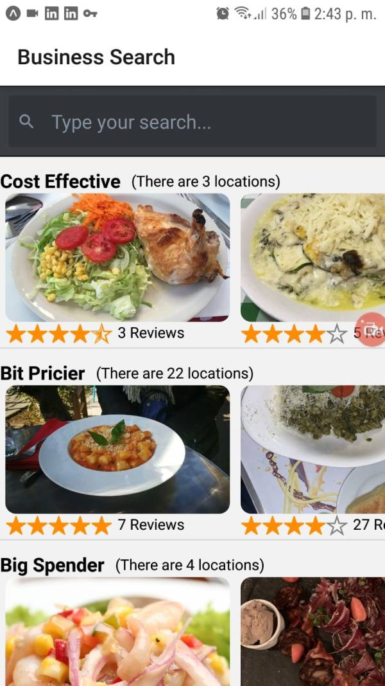
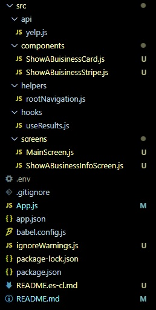
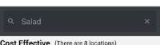
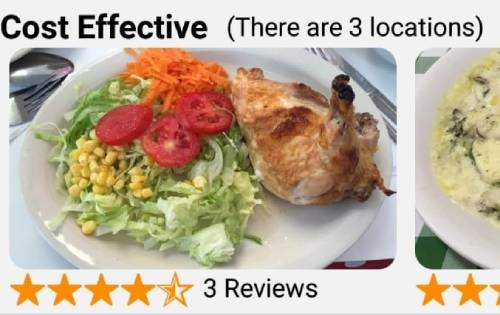

# **Restaurant suggestions in Santiago**

Date: octuber 2021

Author: Rafael Soteldo

Main technologies used: React, React Native, React Native Navigation, Expo, Consuming Api, hooks

---

<!--  -->

<a href="https://www.youtube.com/shorts/e75IzpoNlB0" target="_blank">

</a>

Please, click the image to watch a short video of this app on YouTube

---

This app was developed to be used in any mobile device.

Given a food preference from the user, it shows real suggestions (using the fusion yelp api https://fusion.yelp.com/) of restaurants that offer the preference, in three different categories: Cost Effective, Bit Pricier and Big Spender.

Each category will show the number of real locations found, the name of the restaurant, the rating, and the number of reviews fouund for the restaurant.

## **Project Structure**

The folder that contains the most logic is **src**, with the following content:

-  **src/api/yelp.js**, contains the default axios create,
-  **src/components**, contains the components used by the actual screens,
-  **src/helpers/rootNavigation.js**, exposes the navigate functions, inserted to a ref by the NavigationContainer provider,
-  **src/screens**, contains the screens of the app, similar to pages in a bare react project,

   

There are other important files like **App.js** which is the entry point of the app, it ensembles all the pieces toguether:

```jsx
// App.js
const Stack = createStackNavigator();

const App = () => {
   return (
      <NavigationContainer ref={navigationRef}>
         <Stack.Navigator initialRouteName={"Search"}>
            <Stack.Screen
               name="Search"
               component={SearchScreen}
               options={{ title: "Business Search" }}
            />
            <Stack.Screen
               name="ResultsShow"
               component={ResultsShowScreen}
               options={{ title: "Results Show Search" }}
            />
         </Stack.Navigator>
      </NavigationContainer>
   );
};
```

The app encloses everything within a NavigationContainer. Then it defines the main screens (pages) of the app: **ResultsShowScreen** and **SearchScreen**.

This screens are available as stack screens, meaning that they are available one on top of the other, and the way to navigate to one another is by the use of a button, or a TouchableOpacity, in order to issue a navigation action.

The initial screen showed when launching the app is Search (`initialRouteName={"Search"}`)

## <ins>src/screens/SearchScreen.js</ins>


```jsx
// src/screens/SearchScreen.js
<View style={{ flex: 1 }}>
   <SearchBar
      placeholder="Type your search..."
      darkTheme
      onChangeText={setTerm}
      value={term}
      onEndEditing={() => searchApi(term)}
   />
   {errorMessage ? <Text>{errorMessage}</Text> : null}
   <ScrollView>
      <View // Cheaper
         style={{
            borderBottomColor: "lightgray",
            borderBottomWidth: 1,
            marginTop: 5,
            paddingBottom: 2,
         }}
      >
         <ResultsList
            results={filterResultsByPrice("$")}
            title="Cost Effective"
         />
      </View>
      <View // Bit pricier
         style={{
            borderBottomColor: "lightgray",
            borderBottomWidth: 1,
            marginTop: 5,
            paddingBottom: 2,
         }}
      >
         <ResultsList
            results={filterResultsByPrice("$$")}
            title="Bit Pricier"
         />
      </View>
      <View // Big spender
         style={{
            marginTop: 5,
         }}
      >
         <ResultsList
            results={filterResultsByPrice("$$$$")}
            title="Big Spender"
         />
      </View>
   </ScrollView>
</View>
```

This screen shows the suggestions for restaurants that offer the food preference of the user.

The user can enter his/her preference in the search bar  located at the top of the screen.

The first element we see is the SearchBar. This element was imported from the "react-native-elements" library (https://reactnativeelements.com/docs/components/searchbar)

Then we see three sections:

-  cost effective
-  bit pricier
-  big spender

each one is shown as:

```jsx
// src/screens/SearchScreen.js
<View // Cheaper
   style={{
      borderBottomColor: "lightgray",
      borderBottomWidth: 1,
      marginTop: 5,
      paddingBottom: 2,
   }}
>
   <ResultsList results={filterResultsByPrice("$")} title="Cost Effective" />
</View>
```

`ResultsList` is a component located in `src/components/ResultsList.js`

## <ins>src/components/ResultsList.js</ins>

It is in charge of showing an horizontal list of restaurant suggestions,



```jsx
// src/components/ResultsList.js
<View>
   <View style={{ flexDirection: "row" }}>
      <Text style={styles.title}>{title}</Text>
      <Text style={{ paddingTop: 8, marginLeft: 10 }}>
         (There are {results.length} locations)
      </Text>
   </View>
   <FlatList
      horizontal
      data={results}
      showsHorizontalScrollIndicator={false}
      keyExtractor={(result) => result.id}
      renderItem={({ item }) => {
         return (
            <TouchableOpacity
               onPress={() =>
                  RootNavigation.navigate("ResultsShow", {
                     id: item.id,
                  })
               }
            >
               <ResultsDetail
                  restName={item.name}
                  restImage={item.image_url}
                  restUrl={item.url}
                  restRating={item.rating}
                  restReviews={item.review_count}
               />
            </TouchableOpacity>
         );
      }}
   />
</View>
```

It shows:

-  The number of locations found in yelp, for this category, and for the search text (user preference),
-  And, for every location found in the result set from yelp (using `src/components/ResultsDetail.js`):

   -- An image provided by the restaurant to yelp,

   -- Number of stars the location has obtained by its users,

   -- The number of reviews the location has obtained by its users,

```jsx
// src/components/ResultsDetail.js
<View>
   <Image
      style={styles.image}
      source={{
         uri: `${restImage}`,
      }}
   />
   <View style={{ flexDirection: "row", marginLeft: 5 }}>
      <StarRating
         disabled={false}
         emptyStar={"ios-star-outline"}
         fullStar={"ios-star"}
         halfStar={"ios-star-half"}
         iconSet={"Ionicons"}
         maxStars={5}
         starSize={20}
         rating={restRating}
         selectedStar={(rating) => this.onStarRatingPress(rating)}
         fullStarColor={"darkorange"}
      />
      <Text style={styles.reviewCount}>{restReviews} Reviews</Text>
   </View>
</View>
```

StarRating was imported from the "react-native-star-rating" library https://www.npmjs.com/package/react-native-star-rating

The user can scroll through the lists of restaurants within each category, or click on one of the images to enter `ResultsShowScreen.js`, which is invoked through a `TouchableOpacity` that encloses the call to `ResultsDetail.js`.

## <ins>src/components/ResultsShowScreen.js</ins>

Once an image is clicked in `ResultsList.js`, the `ResultsShowScreen.js` is invoked, and it shows the details of the restaurant selected.

```jsx
// src/screens/ResultsShowScreen.js
const screenHeader = () => {
   return <Text style={styles.name}>{results.name}</Text>;
};

const screenFooter = () => {
   return (
      <View>
         <TouchableOpacity onPress={() => Linking.openURL(results.url)}>
            <Text style={styles.url}>Visit our page</Text>
         </TouchableOpacity>
         <View style={{ flexDirection: "row", marginLeft: 5 }}>
            <StarRating
               disabled={false}
               emptyStar={"ios-star-outline"}
               fullStar={"ios-star"}
               halfStar={"ios-star-half"}
               iconSet={"Ionicons"}
               maxStars={5}
               starSize={20}
               rating={results.rating}
               selectedStar={(rating) => this.onStarRatingPress(rating)}
               fullStarColor={"darkorange"}
            />
         </View>
         <Text style={styles.address}>{results.location.address1}</Text>
         <Text>{results.location.city}</Text>
      </View>
   );
};

if (!results) return null;
else
   return (
      <FlatList
         style={{ flex: 1 }}
         nestedScrollEnabled
         data={results.photos}
         keyExtractor={(photo) => photo}
         ListHeaderComponent={screenHeader}
         ListFooterComponent={screenFooter}
         renderItem={({ item }) => {
            return <Image style={styles.image} source={{ uri: item }} />;
         }}
      />
   );
```

The reason for having a `ListHeaderComponent` and a `ListFooterComponent` inside a FlatList, to show what's before and after such FlatList, and not a `ScrollView` with elements and the FlatList inside of it, is to avoid a warning telling that "VirtualizedLists should never be nested inside plain ScrollViews.".

## **rootNavigation.js, the hook useResults.js and yelp.js**

## <ins>src/helpers/rootnavigation.js</ins>

In order to ease the navigation between screens, we attach a ref variable to the navigationContainer in `App.js: <NavigationContainer ref={navigationRef}>`

Now, in `rootNavigation.js` we export a navigate function from this ref:

```jsx
// src/helpers/rootnavigation.js
export const navigationRef = React.createRef();

export function navigate(name, params) {
   navigationRef.current?.navigate(name, params);
}
```

And use it later like in `resultsList.js`:

```jsx
// src/components/ResultsList.js
<TouchableOpacity
   onPress={() =>
      RootNavigation.navigate("ResultsShow", {
         id: item.id,
      })
   }
>
```

## <ins>src/hooks/useResults.js</ins>

When `SearchScreen.js` needs to load from the yelp Api, it uses `useResults.js`:

```jsx
// src/screens/SearchScreen.js
const [searchApi, results, errorMessage] = useResults();
...
<SearchBar
   placeholder="Type your search..."
   darkTheme
   onChangeText={setTerm}
   value={term}
   onEndEditing={() => searchApi(term)} <=== here, we use the useResults hook
/>
```

This hook invokes the Yelp Api, and places the results in `results`, if there is an error, it places the error message in `errorMessage`.

It limits the load to 50 results, and also limits the serach in the city of Santiago de Chile.

You can find the specifications of the Yelp Api here: https://www.yelp.com/developers/documentation/v3/get_started

```jsx
// src/hooks/useResults.js
export default () => {
   const [results, setResults] = useState([]);
   const [errorMessage, setErrorMessage] = useState("");

   const searchApi = async (searchTerm) => {
      try {
         setErrorMessage("");
         const response = await yelp.get("/search", {
            params: {
               limit: 50,
               term: searchTerm,
               location: "santiago de chile",
            },
         });
         setResults(response.data.businesses);
      } catch (error) {
         setErrorMessage(
            "Something went wrong with the connection with yelp, please try again"
         );
      }
   };

   useEffect(() => {
      searchApi("pasta");
   }, []);

   return [searchApi, results, errorMessage];
};
```

Load pasta restaurants by default:

```jsx
// src/hooks/useResults.js
...
useEffect(() => {
   searchApi("pasta");
}, []);
```

## <ins>src/api/yelp.js</ins>

It is in charge of creating the axios instance, and also of the configuration of the headers.

```jsx
export default axios.create({
   baseURL: "https://api.yelp.com/v3/businesses",
   headers: {
      Authorization: `Bearer ${YELP_AUTH}`,
   },
});
```

I use the .env file to keep the yelp authorization key.

After installing react-native-dotenv, I have to place the plugin the `babel.config.js` file:

```jsx
module.exports = function (api) {
   api.cache(true);  <=== It ensures that the configuration is cached, so that it is not called every time
                          the app is started.
   return {
      presets: ["babel-preset-expo"],
      plugins: [
         [
            "module:react-native-dotenv",
            {
               moduleName: "@env",
               path: ".env",
               blacklist: null,
               whitelist: null,
               safe: false,
               allowUndefined: true,
            },
         ],
      ],
   };
};
```
