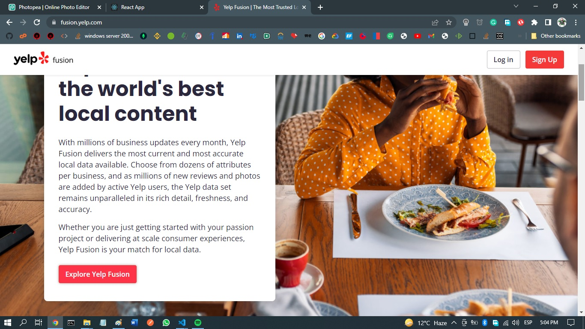
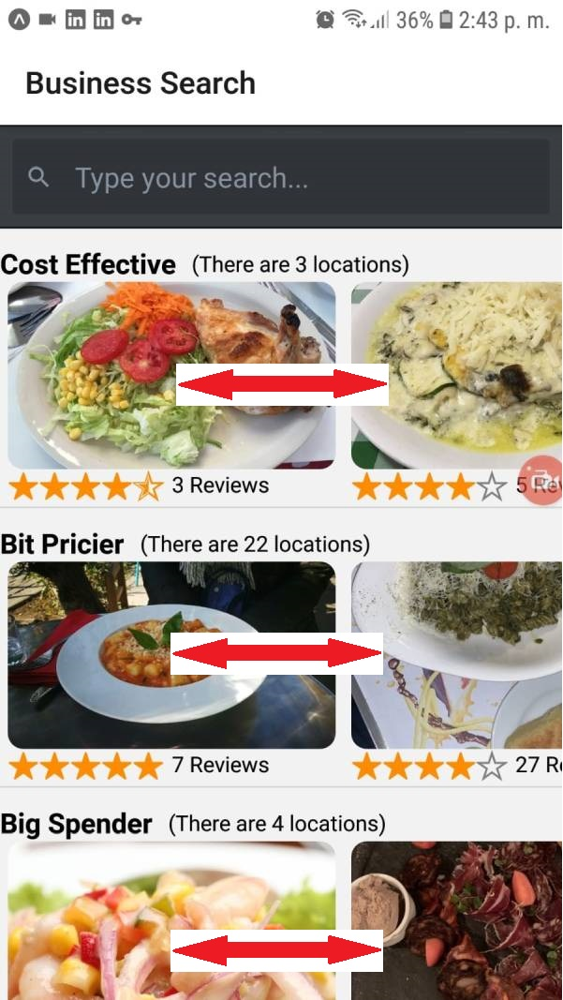
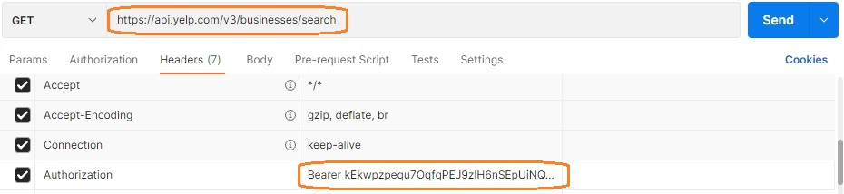
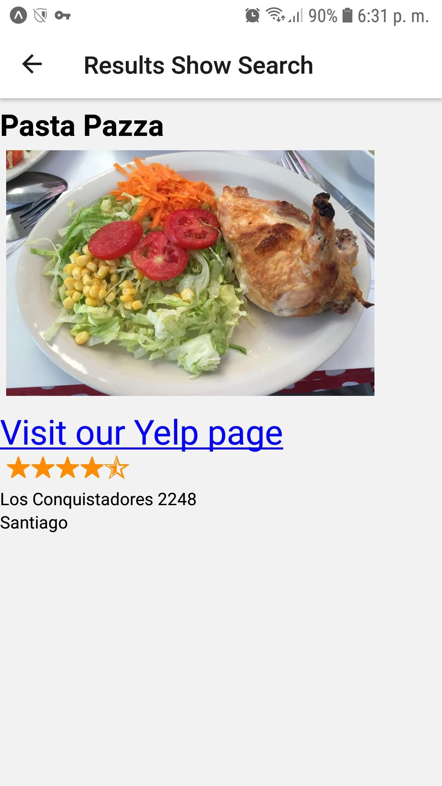

[](https://github.com/rafaelsoteldosilva/restaurants-suggestions/blob/main/README.es-cl.md)

# **Restaurant suggestions in Santiago**

Date: octuber 2021

Author: Rafael Soteldo

Main technologies used:

-  React,
-  React Native,
-  React Native Navigation,
-  Expo,
-  Consuming Yelp Api,
-  hooks

Yelp is an american company that publishes `reviews` of sources as `Restaurants`, `Bars`, `Coffee & Tea`, `Nightlife`, etc. around the world

---

<p align="center">
  
</p>

---

## **Installation guide**

-  `GIT Clone` the repo into your hard drive
-  `cd` into the created folder
-  Run `npm install` in order to install all dependencies
-  Get an API from yelp:

   -  Go to `Yelp Fusion`
   -  Click on `Explore Yelp Fusion`
   -  `Sign Up` or `Login`
   -  Click on `Manage App`
   -  Copy the `API Key`
   <p align="center">
      
      
      
      
   </p>

-  Create an `.env` in the root folder
-  Paste the KEY into this file, giving it the name `YELP_AUTH`:

```jsx
// .env
YELP_AUTH=kEkwpzpequ7OqfqPEJ9zIH6nSEpUiNQW8...
```

Now, in order to be able to excecute the app in your device, you have to install `Expo` in it:

<p align="center">
   
</p>

Once `Expo` was installed in your device, you can execute the app from `VS Code` or your favorite `IDE`, run `Expo Start`, wait for the following message:

<p align="center">
   
</p>

You can scan the QR that's there, or, like me, go to the address `http://localhost:19002`:

<p align="center">
   
</p>

Once there, `expo` gives you the possibility of running the app in a device emulator, if you want to continue with the phisical device, you can now scan the QR with `Expo` in your device

<p align="center">
   
</p>

That´s how my dark theme looks, then press `Scan QR code`, and, there you go...

You must be using the same wifi (from the computer and your device) in order for it to work, if you want to use your device company's data, you can use the `tunnel` feature located in `localhost:19002` (it takes a little longer to build, but it works ok. But you have to be careful, if you change the connection type, expo remains so configured, and if you go back, it'll fail. There must be a way to reconfigure expo, but in the meantime, uninstall and install expo again in your device is a solution)

## **About the project**

This app was developed to be used in any mobile device.

Given a food type preference from the user, it shows real suggestions in the city of Santiago de Chile (using the fusion yelp api https://fusion.yelp.com/).

These suggestions will be shown under three categories: cost-effective, bit pricier and big spender (three scrollable stripes).

<p align="center">
   
</p>

Each category will show the number of real locations found, the rating of each locale, the number of `reviews` given by the users of each locale, and an image.

## **Project Structure**

The project structure is as follows:

<p align="center">
  
</p>

The folder that contains the most logic is **src**, with the following content:

-  **src/api/yelp.js**, contains the default `axios create`,
-  **src/components**, contains the components used by the actual screens,
-  **src/helpers/rootNavigation.js**, exposes the navigate functions, inserted to a `ref` by the NavigationContainer provider,
-  **src/hooks/useResults.js**
-  **src/screens**, contains the screens of the app, similar to pages in a bare `React` project,

This document explains the constituent parts of the project, in the same order as they are presented in `VS Code` (see image above).

The main technologies used for this project were:

-  React Native,
-  React Native Elements,
-  Hooks,
-  React Native Navigation,
-  Expo

### **The src folder**

The **src** folder is the main folder of the project, since it contains almost all the functional files that make the entire app

Its main subfolders are:

-  **api**
-  **components**
-  **helpers**
-  **hooks**
-  **screens**

### - **<ins>src/api/yelp.js</ins>**

It is in charge of creating the axios instance, and also of the configuration of the headers of each request.

```jsx
export default axios.create({
   baseURL: "https://api.yelp.com/v3/businesses",
   headers: {
      Authorization: `Bearer ${YELP_AUTH}`,
   },
});
```

Note that I use the `businesses` endpoint of the yelp api.

We could also make queries from `Postman`, for example, if we wanted to know 8 restaurants, in the area of New York (NYC), we could do it as:

1- Start building the query, and paste the YELP_AUTH that you've got from the yelp-fussion website:

<p align="center">
  
</p>

2- Then add the parameters:

<p align="center">
  
</p>

3- Then click SEND, and the result would be:

```
{
    "businesses": [
        {
            "id": "H4jJ7XB3CetIr1pg56CczQ",
            "alias": "levain-bakery-new-york",
            "name": "Levain Bakery",
            "image_url": "https://s3-media3.fl.yelpcdn.com/bphoto/DH29qeTmPotJbCSzkjYJwg/o.jpg",
            "is_closed": false,
            "url": "https://www.yelp.com/biz/levain-bakery-new-york?adjust_creative=HQql3bXf5X8gxeg-FkuQ4A&utm_campaign=yelp_api_v3&utm_medium=api_v3_business_search&utm_source=HQql3bXf5X8gxeg-FkuQ4A",
            "review_count": 8931,
            "categories": [
                {
                    "alias": "bakeries",
                    "title": "Bakeries"
                }
            ],
            "rating": 4.5,
            "coordinates": {
                "latitude": 40.779961,
                "longitude": -73.980299
            },
            "transactions": [],
            "price": "$$",
            "location": {
                "address1": "167 W 74th St",
                "address2": "",
                "address3": "",
                "city": "New York",
                "zip_code": "10023",
                "country": "US",
                "state": "NY",
                "display_address": [
                    "167 W 74th St",
                    "New York, NY 10023"
                ]
            },
            "phone": "+19174643769",
            "display_phone": "(917) 464-3769",
            "distance": 8369.262424680568
        },
        {
            "id": "V7lXZKBDzScDeGB8JmnzSA",
            "alias": "katzs-delicatessen-new-york",
            "name": "Katz's Delicatessen",
            "image_url": "https://s3-media1.fl.yelpcdn.com/bphoto/mrIdx2pZ3pR2UlqjKsSMZA/o.jpg",
            "is_closed": false,
            "url": "https://www.yelp.com/biz/katzs-delicatessen-new-york?adjust_creative=HQql3bXf5X8gxeg-FkuQ4A&utm_campaign=yelp_api_v3&utm_medium=api_v3_business_search&utm_source=HQql3bXf5X8gxeg-FkuQ4A",
            "review_count": 13673,
            "categories": [
                {
                    "alias": "delis",
                    "title": "Delis"
                },
                {
                    "alias": "sandwiches",
                    "title": "Sandwiches"
                },
                {
                    "alias": "soup",
                    "title": "Soup"
                }
            ],
            "rating": 4.0,
            "coordinates": {
                "latitude": 40.722237,
                "longitude": -73.9875259
            },
            "transactions": [
                "pickup",
                "delivery"
            ],
            "price": "$$",
            "location": {
                "address1": "205 E Houston St",
                "address2": "",
                "address3": "",
                "city": "New York",
                "zip_code": "10002",
                "country": "US",
                "state": "NY",
                "display_address": [
                    "205 E Houston St",
                    "New York, NY 10002"
                ]
            },
            "phone": "+12122542246",
            "display_phone": "(212) 254-2246",
            "distance": 1952.3706239726876
        },
        {
            "id": "44SY464xDHbvOcjDzRbKkQ",
            "alias": "ippudo-ny-new-york-7",
            "name": "Ippudo NY",
            "image_url": "https://s3-media1.fl.yelpcdn.com/bphoto/zF3EgqHCk7zBUwD2B3WTEA/o.jpg",
            "is_closed": false,
            "url": "https://www.yelp.com/biz/ippudo-ny-new-york-7?adjust_creative=HQql3bXf5X8gxeg-FkuQ4A&utm_campaign=yelp_api_v3&utm_medium=api_v3_business_search&utm_source=HQql3bXf5X8gxeg-FkuQ4A",
            "review_count": 10278,
            "categories": [
                {
                    "alias": "ramen",
                    "title": "Ramen"
                }
            ],
            "rating": 4.0,
            "coordinates": {
                "latitude": 40.73092,
                "longitude": -73.99015
            },
            "transactions": [
                "pickup",
                "delivery"
            ],
            "price": "$$",
            "location": {
                "address1": "65 4th Ave",
                "address2": "",
                "address3": "",
                "city": "New York",
                "zip_code": "10003",
                "country": "US",
                "state": "NY",
                "display_address": [
                    "65 4th Ave",
                    "New York, NY 10003"
                ]
            },
            "phone": "+12123880088",
            "display_phone": "(212) 388-0088",
            "distance": 2854.3012674083675
        },
        {
            "id": "xEnNFXtMLDF5kZDxfaCJgA",
            "alias": "the-halal-guys-new-york-2",
            "name": "The Halal Guys",
            "image_url": "https://s3-media2.fl.yelpcdn.com/bphoto/pqcdqGpzyurT2pSVA9G2kw/o.jpg",
            "is_closed": false,
            "url": "https://www.yelp.com/biz/the-halal-guys-new-york-2?adjust_creative=HQql3bXf5X8gxeg-FkuQ4A&utm_campaign=yelp_api_v3&utm_medium=api_v3_business_search&utm_source=HQql3bXf5X8gxeg-FkuQ4A",
            "review_count": 9886,
            "categories": [
                {
                    "alias": "foodstands",
                    "title": "Food Stands"
                },
                {
                    "alias": "mideastern",
                    "title": "Middle Eastern"
                },
                {
                    "alias": "halal",
                    "title": "Halal"
                }
            ],
            "rating": 4.0,
            "coordinates": {
                "latitude": 40.761861,
                "longitude": -73.979306
            },
            "transactions": [
                "pickup",
                "delivery"
            ],
            "price": "$",
            "location": {
                "address1": "W 53rd Street And 6th Ave",
                "address2": null,
                "address3": "",
                "city": "New York",
                "zip_code": "10019",
                "country": "US",
                "state": "NY",
                "display_address": [
                    "W 53rd Street And 6th Ave",
                    "New York, NY 10019"
                ]
            },
            "phone": "+13475271505",
            "display_phone": "(347) 527-1505",
            "distance": 6399.019109860832
        },
        {
            "id": "KFnr0CGsHQ2ABFHbLNtobQ",
            "alias": "central-park-conservancy-new-york",
            "name": "Central Park Conservancy",
            "image_url": "https://s3-media2.fl.yelpcdn.com/bphoto/2QeE4ZRjzmUsNDnqXCGqfA/o.jpg",
            "is_closed": false,
            "url": "https://www.yelp.com/biz/central-park-conservancy-new-york?adjust_creative=HQql3bXf5X8gxeg-FkuQ4A&utm_campaign=yelp_api_v3&utm_medium=api_v3_business_search&utm_source=HQql3bXf5X8gxeg-FkuQ4A",
            "review_count": 2649,
            "categories": [
                {
                    "alias": "parks",
                    "title": "Parks"
                }
            ],
            "rating": 5.0,
            "coordinates": {
                "latitude": 40.764266,
                "longitude": -73.971656
            },
            "transactions": [],
            "location": {
                "address1": "14 E 60th St",
                "address2": "",
                "address3": "",
                "city": "New York",
                "zip_code": "10022",
                "country": "US",
                "state": "NY",
                "display_address": [
                    "14 E 60th St",
                    "New York, NY 10022"
                ]
            },
            "phone": "+12123106600",
            "display_phone": "(212) 310-6600",
            "distance": 6814.558069627135
        },
        {
            "id": "jVncyqXwlx_D9f2xZn05tg",
            "alias": "the-metropolitan-museum-of-art-new-york-3",
            "name": "The Metropolitan Museum of Art",
            "image_url": "https://s3-media1.fl.yelpcdn.com/bphoto/NcHMjAQ1mgaPKwQEEOLM_A/o.jpg",
            "is_closed": false,
            "url": "https://www.yelp.com/biz/the-metropolitan-museum-of-art-new-york-3?adjust_creative=HQql3bXf5X8gxeg-FkuQ4A&utm_campaign=yelp_api_v3&utm_medium=api_v3_business_search&utm_source=HQql3bXf5X8gxeg-FkuQ4A",
            "review_count": 3152,
            "categories": [
                {
                    "alias": "artmuseums",
                    "title": "Art Museums"
                }
            ],
            "rating": 4.5,
            "coordinates": {
                "latitude": 40.779449,
                "longitude": -73.963245
            },
            "transactions": [],
            "location": {
                "address1": "1000 5th Ave",
                "address2": "",
                "address3": "",
                "city": "New York",
                "zip_code": "10028",
                "country": "US",
                "state": "NY",
                "display_address": [
                    "1000 5th Ave",
                    "New York, NY 10028"
                ]
            },
            "phone": "+12125357710",
            "display_phone": "(212) 535-7710",
            "distance": 8634.601734170283
        },
        {
            "id": "jnEv25Y2DosTq2sNnvmC9g",
            "alias": "los-tacos-no-1-new-york",
            "name": "Los Tacos No.1",
            "image_url": "https://s3-media2.fl.yelpcdn.com/bphoto/FU44TYl3PzXsE06G4W5aog/o.jpg",
            "is_closed": false,
            "url": "https://www.yelp.com/biz/los-tacos-no-1-new-york?adjust_creative=HQql3bXf5X8gxeg-FkuQ4A&utm_campaign=yelp_api_v3&utm_medium=api_v3_business_search&utm_source=HQql3bXf5X8gxeg-FkuQ4A",
            "review_count": 3389,
            "categories": [
                {
                    "alias": "tacos",
                    "title": "Tacos"
                }
            ],
            "rating": 4.5,
            "coordinates": {
                "latitude": 40.7425547,
                "longitude": -74.0060838
            },
            "transactions": [
                "delivery"
            ],
            "price": "$",
            "location": {
                "address1": "75 9th Ave",
                "address2": "",
                "address3": "",
                "city": "New York",
                "zip_code": "10011",
                "country": "US",
                "state": "NY",
                "display_address": [
                    "75 9th Ave",
                    "New York, NY 10011"
                ]
            },
            "phone": "",
            "display_phone": "",
            "distance": 4244.358699250552
        },
        {
            "id": "WHRHK3S1mQc3PmhwsGRvbw",
            "alias": "bibble-and-sip-new-york-2",
            "name": "Bibble & Sip",
            "image_url": "https://s3-media1.fl.yelpcdn.com/bphoto/qVGATBDmFAaXL9l5Yzv-ww/o.jpg",
            "is_closed": false,
            "url": "https://www.yelp.com/biz/bibble-and-sip-new-york-2?adjust_creative=HQql3bXf5X8gxeg-FkuQ4A&utm_campaign=yelp_api_v3&utm_medium=api_v3_business_search&utm_source=HQql3bXf5X8gxeg-FkuQ4A",
            "review_count": 5276,
            "categories": [
                {
                    "alias": "coffee",
                    "title": "Coffee & Tea"
                },
                {
                    "alias": "bakeries",
                    "title": "Bakeries"
                },
                {
                    "alias": "desserts",
                    "title": "Desserts"
                }
            ],
            "rating": 4.5,
            "coordinates": {
                "latitude": 40.7628355,
                "longitude": -73.98518009478293
            },
            "transactions": [
                "pickup",
                "delivery"
            ],
            "price": "$$",
            "location": {
                "address1": "253 W 51st St",
                "address2": "",
                "address3": "",
                "city": "New York",
                "zip_code": "10019",
                "country": "US",
                "state": "NY",
                "display_address": [
                    "253 W 51st St",
                    "New York, NY 10019"
                ]
            },
            "phone": "+16466495116",
            "display_phone": "(646) 649-5116",
            "distance": 6427.569355387715
        }
    ],
    "total": 26100,
    "region": {
        "center": {
            "longitude": -73.99429321289062,
            "latitude": 40.70544486444615
        }
    }
}
```

You see that for each of them you get things like:

-  The name
-  An image URL
-  The review count
-  The rating
-  The address
-  The price level
-  A phone number
-  etc.

Remember that `$`, `$$`, `$$$`, `$$$$` are the level of prices. In this app I only used `$`, `$$`, `$$$$`

## **components**

Contains all the components used by the actual pages and other components.

### - **<ins>src/components/ShowABusinessCard.js</ins>**

For a given business, and having things like name, image, rating, etc., shows a little card of the business, several cards of the same type conform a `business stripe`

```jsx
// src/components/ShowABusinessCard.js
<View>
   // Show the received image
   <Image
      style={styles.image}
      source={{
         uri: `${restImage}`,
      }}
   />
   // Show received star rating
   <View style={{ flexDirection: "row", marginLeft: 5 }}>
      <StarRating
         disabled={false}
         emptyStar={"ios-star-outline"}
         fullStar={"ios-star"}
         halfStar={"ios-star-half"}
         iconSet={"Ionicons"}
         maxStars={5}
         starSize={20}
         rating={restRating}
         selectedStar={(rating) => this.onStarRatingPress(rating)}
         fullStarColor={"darkorange"}
      />
      <Text style={styles.reviewCount}>{restReviews} Reviews</Text>
   </View>
</View>
```

<p align="center">
  
</p>

### - **<ins>src/components/ShowABusinessStripe.js</ins>**

Shows a "Stripe" of the businesses found in the yelp api, for a given price level

It traverses `results`, and for each business shows a business card, and the possibility to click on each, in order to navigate to `ShowABusinessInfo`

The variable `results` is the result of invoking the yelp api (see `SearchBar` inside `src/screens/MainScreen.js`)

```jsx
// src/components/ShowABusinessStripe.js
<View>
   <View style={{ flexDirection: "row" }}>
      <Text style={styles.title}>{title}</Text>
      <Text style={{ paddingTop: 8, marginLeft: 10 }}>
         (There are {results.length} locations)
      </Text>
   </View>
   <FlatList
      horizontal
      data={results}
      showsHorizontalScrollIndicator={false}
      keyExtractor={(result) => result.id}
      renderItem={({ item }) => {
         return (
            <TouchableOpacity
               onPress={() =>
                  RootNavigation.navigate("ShowABusinessInfo", {
                     id: item.id,
                  })
               }
            >
               <ShowABuisinessCard
                  restName={item.name}
                  restImage={item.image_url}
                  restUrl={item.url}
                  restRating={item.rating}
                  restReviews={item.review_count}
               />
            </TouchableOpacity>
         );
      }}
   />
</View>
```

<p align="center">
  
</p>

You can scroll it from left to right and vice versa. That´s one of the advantages of `flatList`

## **helpers**

### - **<ins>src/helpers/rootNavigation.js</ins>**

It delivers a `ref` that makes it easier to navigate to other screens

```jsx
// src/helpers/rootNavigation.js
export const navigationRef = React.createRef();

export function navigate(name, params) {
   navigationRef.current?.navigate(name, params);
}
```

An example of this can be seen above:

```jsx
// src/components/ShowABusinessStripe.js
...
               onPress={() =>
                  RootNavigation.navigate("ShowABusinessInfo", {
...
```

## **hooks**

### - **<ins>src/hooks/useResults.js</ins>**

It is a hook that make it easier the use of the yelp api

It expones a `searchApi` which is a function that, given a search term like `salad`, completes the search in the yelp api:

```jsx
// src/hooks/useResults.js
const searchApi = async (searchTerm) => {
   try {
      setErrorMessage("");
      const response = await yelp.get("/search", {
         params: {
            limit: 50,
            term: searchTerm,
            location: "santiago de chile",
         },
      });
      setResults(response.data.businesses);
   } catch (error) {
      setErrorMessage(
         "Something went wrong with the connection with yelp, please try again"
      );
   }
};
```

As you can see, it completes the query string with `/search`, and also completes `limit` and `location`

(the maximum limit allowed by the yelp api is 50)

For example, if we were to search for `salad`, the resulting `query` would be:

`https://api.yelp.com/v3/businesses/search?limit=50&searchterm=salad&location=santiago%20de%20chile`

Then sets the results to the state variable `results`, now we can start by traversing it looking for the restaurants at certain price level, etc..

## **screens**

It's were the actual screens reside

### - **<ins>src/screens/MainScreen.js</ins>**

This is the main screen of the app, when we start the app, it shows:

```jsx
// src/screens/MainScreen.js
<SafeAreaView style={{ flex: 1 }}>
   <SearchBar
      // round
      placeholder="Type your preferred food type..."
      darktheme
      onChangeText={setTerm}
      value={term}
      onEndEditing={() => searchApi(term)}
   />
   {errorMessage ? <Text>{errorMessage}</Text> : null}
   <ScrollView>
      <View // Cheaper
         style={{
            borderBottomColor: "lightgray",
            borderBottomWidth: 1,
            marginTop: 5,
            paddingBottom: 2,
         }}
      >
         <ShowABusinessStripe
            // This is the Cost Effective stripe
            results={filterResultsByPrice("$")}
            title="Cost Effective"
         />
      </View>
      <View // Bit pricier
         style={{
            borderBottomColor: "lightgray",
            borderBottomWidth: 1,
            marginTop: 5,
            paddingBottom: 2,
         }}
      >
         <ShowABusinessStripe
            // This is the Bit Pricier stripe
            results={filterResultsByPrice("$$")}
            title="Bit Pricier"
         />
      </View>
      <View // Big spender
         style={{
            marginTop: 5,
         }}
      >
         <ShowABusinessStripe
            // This is the Big Spender stripe
            results={filterResultsByPrice("$$$$")}
            title="Big Spender"
         />
      </View>
   </ScrollView>
</SafeAreaView>
```

By using `SafeAreaView` we ensure that if what we are showing on the screen of the device, it can be scrolled to see the rest.

The function `filterResultsByPrice` simply traverses the `search result` looking for certain price level, and returning the corresponding subset

```jsx
// src/screens/MainScreen.js
...
const filterResultsByPrice = (price) => {
   return results.filter((result) => {
      return result.price === price;
   });
};
...
```

`SearchBar` belongs to `React Native Elements`, and it displays and gives functionality to the search bar:

<p align="center">
  
</p>

In the case of the picture, the user typed `Salad`. The code for this `SearchBar` is:

```jsx
// src/screens/MainScreen.js
...
<SearchBar
   // round
   placeholder="Type your preferred food type..."
   darktheme
   onChangeText={setTerm}
   value={term}
   onEndEditing={() => searchApi(term)}
/>
...
```

When the user ends editing his preferred food type, the `searchApi` function is called, which searchs the api for the term he typed.

### - **<ins>src/screens/ShowABusinessInfoScreen.js</ins>**

It shows a screen with the main info of the locale that the user clicked on (by clicking on a business of one of the business stripes)

```jsx
// src/screens/ShowABusinessInfoScreen.js
...
<SafeAreaView style={{ flex: 1 }}>
    <FlatList
        style={{ flex: 1 }}
        nestedScrollEnabled
        data={results.photos}
        keyExtractor={(photo) => photo}
        ListHeaderComponent={screenHeader}
        ListFooterComponent={screenFooter}
        renderItem={({ item }) => {
            return <Image style={styles.image} source={{ uri: item }} />;
        }}
    />
</SafeAreaView>
...
```

It shows the images available, for the `screenheader` shows the name, and for the footer, it shows the text `Visit our Yelp Page`, the `rating` in the form of stars, the `address` and `location`:

```jsx
// src/screens/ShowABusinessInfoScreen.js
...
<View>
   <TouchableOpacity onPress={() => Linking.openURL(results.url)}>
      <Text style={styles.url}>Visit our Yelp Page</Text>
   </TouchableOpacity>
   <View style={{ flexDirection: "row", marginLeft: 5 }}>
      <StarRating
         disabled={false}
         emptyStar={"ios-star-outline"}
         fullStar={"ios-star"}
         halfStar={"ios-star-half"}
         iconSet={"Ionicons"}
         maxStars={5}
         starSize={20}
         rating={results.rating}
         selectedStar={(rating) => this.onStarRatingPress(rating)}
         fullStarColor={"darkorange"}
      />
   </View>
   <Text style={styles.address}>{results.location.address1}</Text>
   <Text>{results.location.city}</Text>
</View>
...
```

<p align="center">
  
</p>

If you click on `Visit our Yelp Page`, you'll go to the location's yelp web pata:

<p align="center">
  
</p>

From here, you can visit the business web site, go to google map, etc..

## - **<ins>App.js</ins>**

This is what ensambles all toguether:

```jsx
// App.js
...
<NavigationContainer ref={navigationRef}>
   <Stack.Navigator initialRouteName={"Search"}>
      <Stack.Screen
         name="Search"
         component={MainScreen}
         options={{ title: "Business Search" }}
      />
      <Stack.Screen
         name="ShowABusinessInfo"
         component={ShowABusinessInfoScreen}
         options={{ title: "Show a buisiness info" }}
      />
   </Stack.Navigator>
</NavigationContainer>
...
```

It creates two screens in the form of Stack, it means, the only way to see them is by navigating to them by code. The default screen is `MainScreen`

<p align="center">
  
</p>

## **Other important files of the App**

### - **<ins>babel.config.js</ins>**

It is used to configure the app with `Expo`, in this case, the app is being cached, the preset values are set, and the `.env` package was installed

```jsx
// babel.config.js
module.exports = function (api) {
   api.cache(true);
   return {
      presets: ["babel-preset-expo"],
      plugins: [
         [
            "module:react-native-dotenv",
            {
               moduleName: "@env",
               path: ".env",
               blacklist: null,
               whitelist: null,
               safe: false,
               allowUndefined: true,
            },
         ],
      ],
   };
};
```

### - **<ins>ignoreWarnings.js</ins>**

Is used to ignore certain warnings that appear in develop time.
